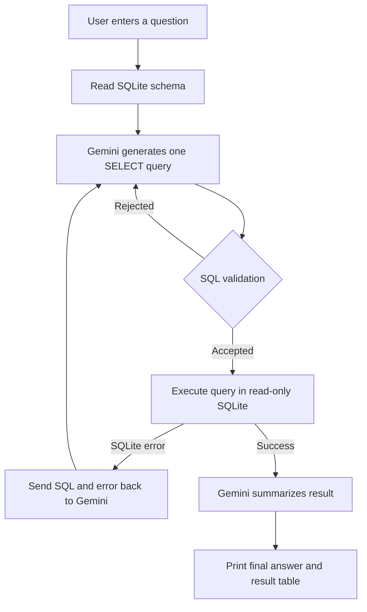

# SQL Query Agent (Text-to-SQL)

An interactive Python CLI application that converts natural-language business questions into safe, read-only SQLite queries using LangChain and Google Gemini.

The agent automatically reads the database schema, generates a SQLite `SELECT` statement, executes it against a sample sales database, repairs invalid SQL when SQLite reports an error, and summarizes the result for business users.

## Features

- Natural-language questions in English or Indonesian.
- Automatic database schema retrieval, including:
  - Table names.
  - Column names and data types.
  - Primary keys.
  - Foreign-key relationships.
- SQL generation with Google Gemini through `langchain-google-genai`.
- Read-only protection:
  - Only one `SELECT` statement is accepted.
  - `INSERT`, `UPDATE`, `DELETE`, `DROP`, `ALTER`, and `PRAGMA` statements are rejected by the SQL validator.
  - The runtime database connection uses SQLite read-only mode.
- SQL self-healing loop with up to three attempts when SQLite returns a syntax or execution error.
- Automatic retry with exponential backoff for temporary Gemini errors such as HTTP `429`, `500`, `502`, `503`, and `504`.
- Transparent terminal logging:
  - `[SQL Generated]`
  - `[Status]`
  - `[Final Answer]`
- Compact result table printed directly in the terminal.
- Sample database initializer with products, customers, and orders.

## How It Works



The SQL repair loop is limited to three total attempts per user question. Gemini capacity and rate-limit errors are handled separately with short exponential backoff retries.

## Project Structure

```text
SQL Query Agent (Text-to-SQL)/
├── app.py                # Interactive Text-to-SQL application
├── init_db.py            # Creates and seeds the sample SQLite database
├── sales.db              # Generated sample database
├── requirements.txt      # Python dependencies
├── .env.example          # Environment variable template
├── .env                  # Local secrets; do not commit
└── README.md             # Project documentation
```

## Requirements

- Python 3.10 or newer.
- A Google Gemini API key.
- Internet access for Gemini API requests.

The project uses:

- `sqlite3`, included with Python.
- `langchain-google-genai` for Gemini integration.
- `python-dotenv` for loading local environment variables.

## Installation

Open PowerShell in the project directory and run:

```powershell
python -m pip install -r requirements.txt
```

If the selected Python installation does not include `pip`, bootstrap it first:

```powershell
python -m ensurepip --upgrade
python -m pip install -r requirements.txt
```

## Configuration

Create a local `.env` file from the example:

```powershell
Copy-Item .env.example .env
```

Edit `.env` and add your Gemini API key:

```env
GEMINI_API_KEY=your_gemini_api_key_here
GEMINI_MODEL=gemini-3.8-flash
```

Never commit `.env` or expose the API key in source code, screenshots, logs, or the example file. If a key has been exposed, revoke it and create a new one in Google AI Studio.

`GEMINI_MODEL` is optional. If it is omitted, the application uses `gemini-3.8-flash`. You can override it with another model available to your API account, for example:

```env
GEMINI_MODEL=gemini-2.5-flash
```

## Initialize the Database

Create the sample database by running:

```powershell
python init_db.py
```

The initializer recreates the database tables and inserts sample data. Running it again resets the sample data because existing tables are dropped first.

## Run the Application

```powershell
python app.py
```

The application opens an interactive terminal prompt:

```text
SQL Query Agent siap. Ketik 'exit' atau 'quit' untuk keluar.

Pertanyaan>
```

Enter a question in English or Indonesian. Use `exit` or `quit` to close the application.

## Example Questions

```text
Tampilkan 5 produk paling banyak terjual.
```

```text
Which customers have placed completed orders?
```

```text
Berapa total quantity penjualan untuk setiap produk?
```

```text
Show all pending orders with customer and product names.
```

Typical terminal output looks like this:

```text
[SQL Generated]: SELECT p.product_name, SUM(o.quantity) AS total_sold ...
[Status]: Berhasil
[Final Answer]: Mechanical Keyboard memiliki jumlah unit terjual tertinggi ...

[Tabel Hasil]:
| product_name         | total_sold |
|----------------------|------------|
| Mechanical Keyboard  | 13         |
```

## Sample Database Schema

### `products`

| Column | Type | Description |
|---|---|---|
| `product_id` | INTEGER | Primary key |
| `product_name` | TEXT | Product name |
| `category` | TEXT | Product category |
| `price` | REAL | Unit price |
| `stock` | INTEGER | Available stock |

### `customers`

| Column | Type | Description |
|---|---|---|
| `customer_id` | INTEGER | Primary key |
| `customer_name` | TEXT | Customer name |
| `email` | TEXT | Unique email address |
| `city` | TEXT | Customer city |
| `joined_date` | TEXT | Registration date |

### `orders`

| Column | Type | Description |
|---|---|---|
| `order_id` | INTEGER | Primary key |
| `customer_id` | INTEGER | References `customers.customer_id` |
| `product_id` | INTEGER | References `products.product_id` |
| `quantity` | INTEGER | Number of units ordered |
| `order_date` | TEXT | Order date |
| `status` | TEXT | For example, `completed`, `pending`, or `cancelled` |

## Security and Safety

This project is designed for read-only analytics over the sample database.

1. The model is instructed to return exactly one SQLite `SELECT` statement.
2. `extract_sql()` rejects multiple statements and non-`SELECT` commands.
3. SQLite is opened with `mode=ro` by `app.py`, so the application cannot modify the database during normal execution.
4. The generated SQL and execution status are printed for transparency.
5. Query results are limited to the first 100 rows for display and summarization.

These protections are appropriate for the sample project but should still be reviewed before connecting the application to sensitive or production databases.

## Error Handling

### SQLite errors

If SQLite rejects the generated query, the error is sent back to Gemini with the previous SQL. Gemini receives up to three total attempts to generate a corrected query.

### Gemini capacity or rate-limit errors

Temporary API errors such as HTTP `503 UNAVAILABLE` are retried automatically. If the model remains unavailable, the application prints a status message and returns to the question prompt instead of terminating with a traceback.

If the problem persists, check the API key, account quota, model availability, and the `GEMINI_MODEL` value in `.env`.

### Missing database

If `sales.db` does not exist, run:

```powershell
python init_db.py
```

### Missing API key

If `GEMINI_API_KEY` is missing, add it to `.env` and restart the application.

## Development Checks

Compile both Python files to check for syntax errors:

```powershell
python -m py_compile app.py init_db.py
```

Start and exit the CLI without making an API request:

```powershell
'quit' | python app.py
```

## Limitations

- The application currently uses a CLI rather than a web interface.
- The sample database is intentionally small and static.
- The model must be available to the configured Gemini API account.
- Natural-language accuracy depends on the quality and availability of the selected Gemini model.
- The application displays at most 100 result rows per question.
- Database schema retrieval is optimized for SQLite and is not intended for other database engines without modification.

## License

This project is provided as a learning and prototype example. Add a license file if you plan to distribute or reuse it publicly.
